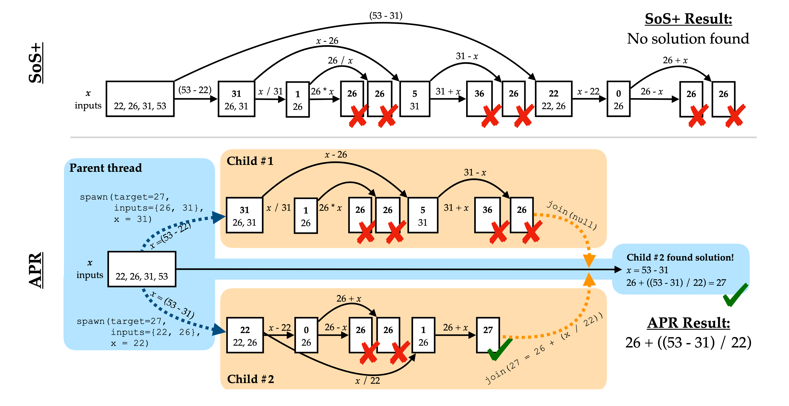

<h1 align="center"> Learning Adaptive Parallel Reasoning with Language Models </h1>

<p align="center">
  <a href="https://www.jiayipan.com/" style="text-decoration: none;">Jiayi Pan</a><sup>*</sup>,
  <a href="https://xiuyuli.com/" style="text-decoration: none;">Xiuyu Li</a><sup>*</sup>,
  <a href="https://tonylian.com/" style="text-decoration: none;">Long Lian</a><sup>*</sup>,
  <a href="https://sea-snell.github.io/" style="text-decoration: none;">Charlie Victor Snell</a>,
  <a href="https://yifeizhou02.github.io/" style="text-decoration: none;">Yifei Zhou</a>,<br>
  <a href="https://www.adamyala.org/" style="text-decoration: none;">Adam Yala</a>,
  <a href="https://people.eecs.berkeley.edu/~trevor/" style="text-decoration: none;">Trevor Darrell</a>,
  <a href="https://people.eecs.berkeley.edu/~keutzer/" style="text-decoration: none;">Kurt Keutzer</a>,
  <a href="https://www.alanesuhr.com/" style="text-decoration: none;">Alane Suhr</a>
</p>

<p align="center">
    UC Berkeley and UCSF &nbsp;&nbsp;&nbsp;<sup>*</sup> Equal Contribution
</p>

<p align="center">
<a href="./assets/apr-paper.pdf">📃 Paper</a>
•
<a href="https://github.com/Parallel-Reasoning/APR" >💻 Code</a>
•
<a href="https://huggingface.co/Parallel-Reasoning" >🤗 Data & Models</a>
</p>




**TL;DR**: 
We present Adaptive Parallel Reasoning (APR), a novel framework that enables language models to learn to orchestrate both serialized and parallel computations. APR trains language models to use `spawn()` and `join()` operations through end-to-end supervised training and reinforcement learning, allowing models to dynamically orchestrate their own computational workflows.
APR efficiently distributes compute, reduces latency, overcomes context window limits, and achieves state‑of‑the‑art performance on complex reasoning tasks (e.g., 83.4% vs. 60.0% accuracy at 4K context on Countdown).

> The arXiv version of the paper and full code will be released soon!
## Data Preparation

## Supervised Training
We use TPU-v3-128 for supervised training with a codebase building upon [JAX_llama](https://github.com/Sea-Snell/JAX_llama). 

Please refer to [the instructions](supervised-jax/README.md) for more details.

## Reinforcement Learning
We present TinyRL, a simple implementation of the GRPO training framework for our experiments. TinyRL is a lightweight yet performant reinforcement learning library designed to be both easy to use and extend. It integrates with [SGLang](https://github.com/sgl-project/sglang) for efficient rollout. Given the small size of the model we’re training, we haven’t implemented model parallelism, so it runs on two GPUs—one for training and one for rollout

It supports asynchronous, multi-turn, multi-agent rollouts through a general `rollout_fun` interface, with the minimal assumption that your rollout mechanism relies on calling an OpenAI-compatible API endpoint. 
```python
def rollout_fun(server_url, prefix_list, bos_token, temperature=0.5, max_workers=32):
  pass
```

Please refer to [the instructions](tinyrl/README.md) for more details.

## Evaluation

## Citation
